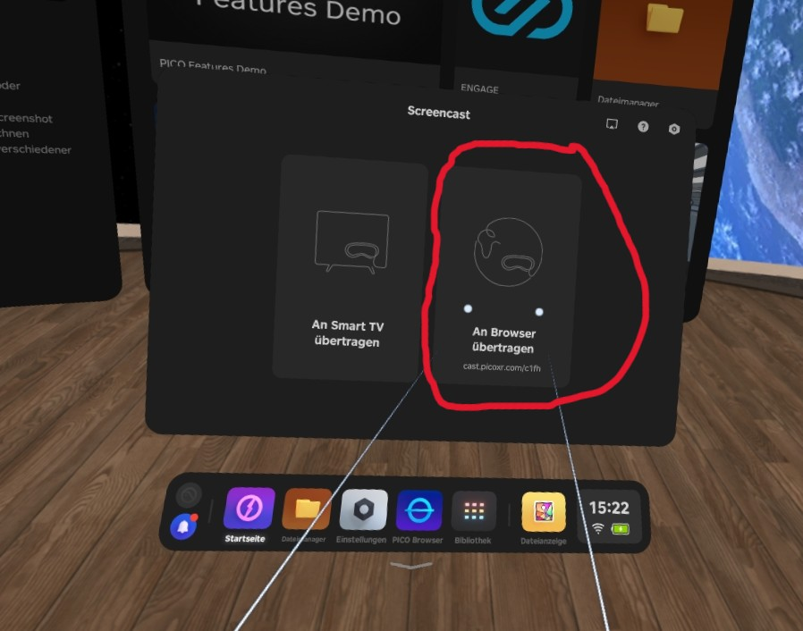
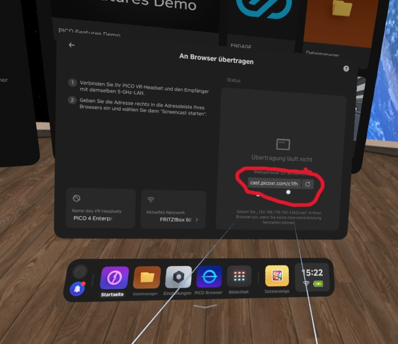
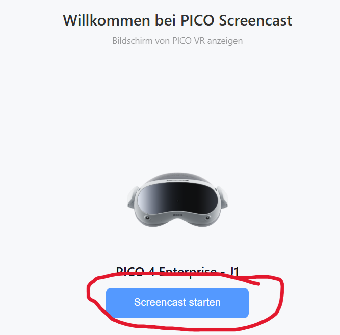
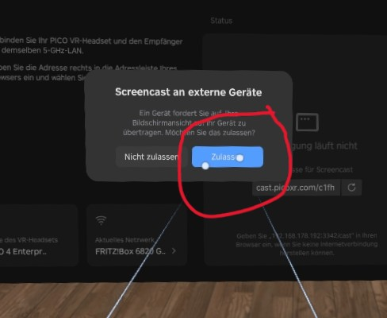

# Ansicht auf externen Bildschirm übertragen

Um auf z.B. Messen zu zeigen, was ein Spieler sieht, ist es möglich die Ansicht einer Brille auf einen externen Bildschirm zu übertragen.

---

## Was wird benötigt?
* **PICO 4 mit der PzH2000 App**
* **WLAN-Router mit 5GHz WLAN** (Bei Routern mit weniger als 5GHz ruckelt die Übertragung zu sehr.)
* **Entweder:** Einen Smart-TV mit einem Webbrowser.
* **Oder:** Einen Laptop, welcher über HDMI mit einem externen Bildschirm verbunden ist.

---

## Wie kann ich den Bildschirm übertragen?

1. Stelle sicher, dass sowohl deine **PICO 4** und dein **Laptop** bzw. **Smart-TV** mit demselben **5GHz WLAN Router** verbunden sind.
2. Gehe in die Bibliothek und starte die **Screencast**-App auf deiner PICO 4. Und wähle **An Browser übertragen**.

    { width="600" }

3. Gib den **Link**, der dir dort angezeigt wird in dem Browser auf deinem externen Bildschirm bzw. Laptop ein.

    { width="600" }

4. Drücke im Browser auf **Screencast starten**

    { width="600" }

5. Wechsle in deine PICO und wähle **Zulassen**

    { width="600" }

Der Screencast sollte nun laufen.

