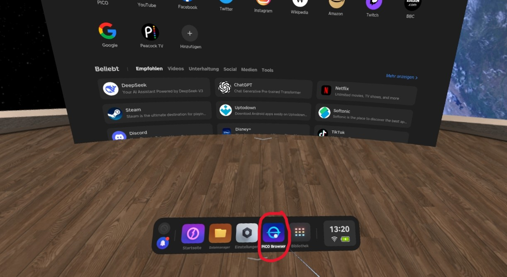
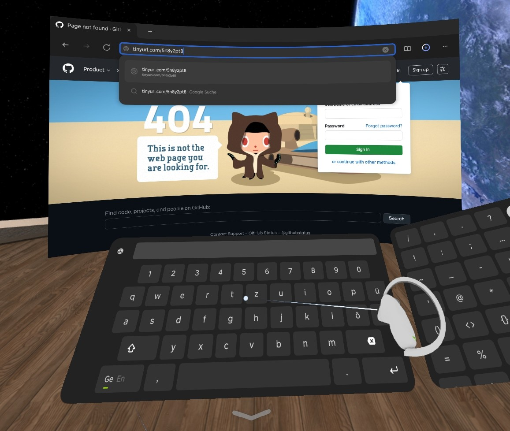
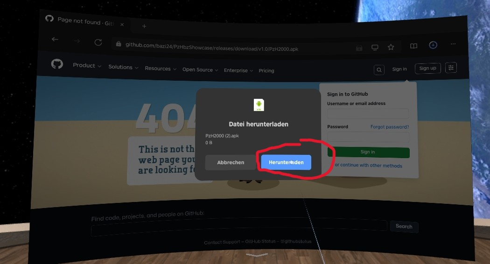
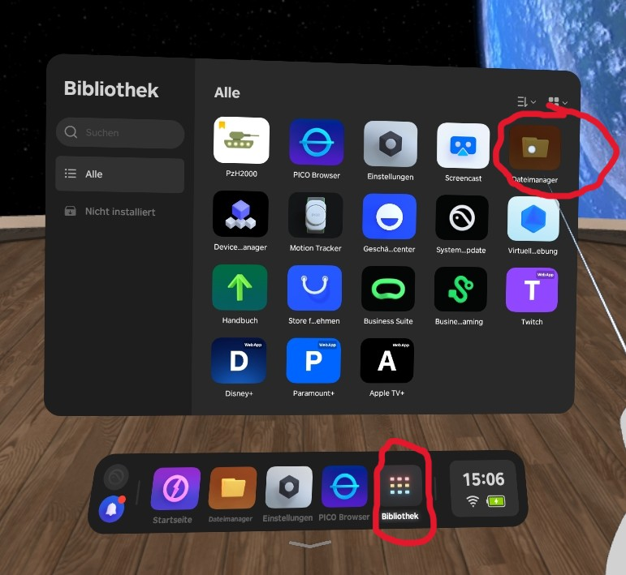
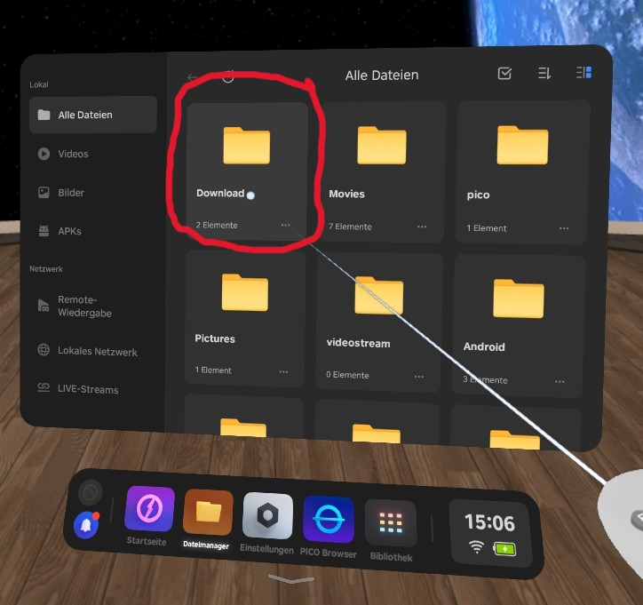
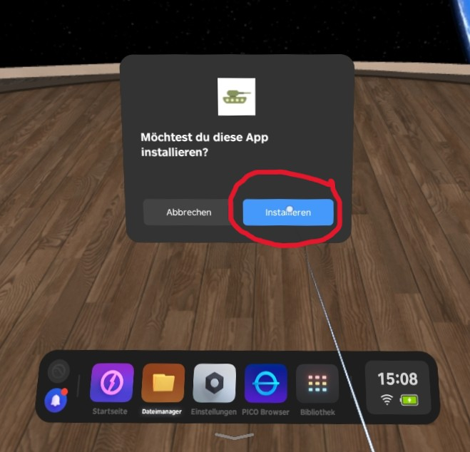
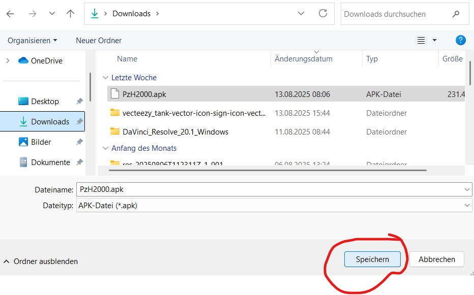
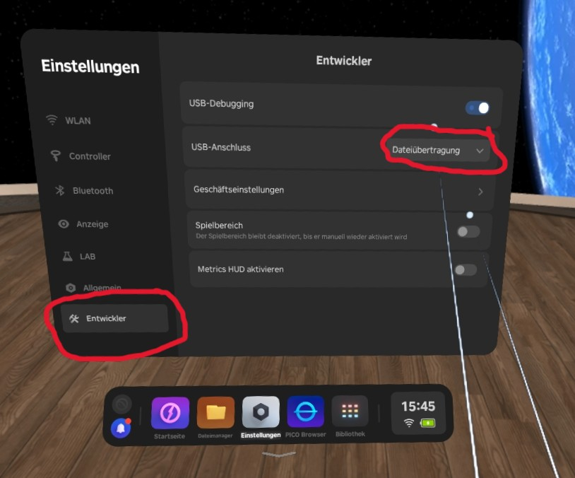
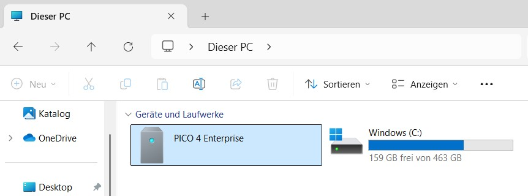
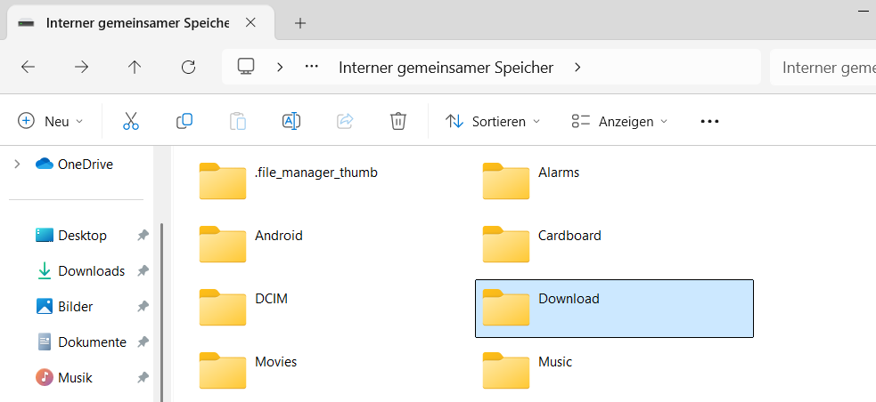

# Installation der App

Hier wird erklärt, wie du die VR Anwendung "PzH 2000" auf der PICO 4 VR-Brille installieren bzw. updaten kannst.

---

## Was man benötigt

* **PICO 4 VR Brille**
* **Installationsdatei (*PzH200.apk*):** Die aktuellste Version kannst du [hier](https://github.com/bazi24/PzHbzShowcase/releases/download/v1.0/PzH2000.apk) herunterladen
* ***Entweder:*** *Einen PC mit offenen USB-Ports (kein BWI-PC) und ein USB-C Kabel*
* ***Oder:*** *Internetzugang (über WLAN) auf der PICO 4*
---

## Installation ohne PC

### **1. Verbinde die PICO 4 mit dem Internet**

Stelle sicher, dass deine PICO 4 mit dem Internet verbunden ist. [Hier](./konfiguration.md#mit-dem-internet-verbinden) findest du eine Anleitung, um die PICO mit dem Internet zu verbinden.

### **2. Lade die Installationsdatei auf der PICO 4 herunter**

Öffne den **PICO Browser** unten im Dock der PICO 4.

{ width="600" }

Gib diesen Link in die Adresszeile ein: ***https://tinyurl.com/5n8y2pt8***

{ width="600" }

Drücke auf **Herunterladen** und warte bis der Download abgeschlossen ist.

{ width="600" }

### **3. App installieren**

Gehe in der **Bibliothek** auf **Dateimanager**.

{ width="600" }

Wähle unter dem Reiter **Alle Dateien** den **Downloads** Ordner aus.

{ width="600" }

Klicke auf die heruntergeladene Datei **PzH2000.apk** und drücke anschließend auf **Installieren**.

{ width="600" }

Nun ist die aktuellste Version der App installiert.

---

## Installation über PC

### **1. Lade die [Installationsdatei](https://github.com/bazi24/PzHbzShowcase/releases/download/v1.0/PzH2000.apk) auf deinen PC herunter**

Klicke [hier](https://github.com/bazi24/PzHbzShowcase/releases/download/v1.0/PzH2000.apk) und lade die Datei auf deinen PC herunter.

{ width="600" }

### **2. PICO 4 konfigurieren**

#### Entwicklermodus aktivieren

Folge dieser [Anleitung](./konfiguration.md#1-entwicklereinstellungen-aktivieren), um den Entwicklermodus auf der PICO 4 zu aktivieren.

#### USB-Datenübertragung aktivieren

Gehe in deiner PICO 4 in die **Einstellungen > Entwickler**. Stelle sicher, dass bei **USB-Anschluss** das Feld **Dateiübertragung** ausgewählt ist.

{ width="600" }

### **3. Installationsdatei auf die PICO 4 kopieren**

Verbinde deine PICO 4 über ein USB-C Kabel mit deinem PC. Stelle sicher, dass deine PICO 4 **eingeschaltet** ist. Der PC sollte die VR Brille nun als externes Medium erkennen. Gehe unter **Computer** auf **PICO 4 Enterprise**.

{ width="600" }

Kopiere die heruntergeladene Installationsdatei **PzH2000** in einen Ordner auf der PICO 4 z.B. den Ordner **Downloads**.

{ width="600" }

### **4. App installieren**

Gehe in der **Bibliothek** auf **Dateimanager**.

{ width="600" }

Wähle unter dem Reiter **Alle Dateien** den **Downloads** Ordner aus.

{ width="600" }

Klicke auf die heruntergeladene Datei **PzH2000.apk** und drücke anschließend auf **Installieren**.

{ width="600" }

Nun ist die aktuellste Version der App installiert

---