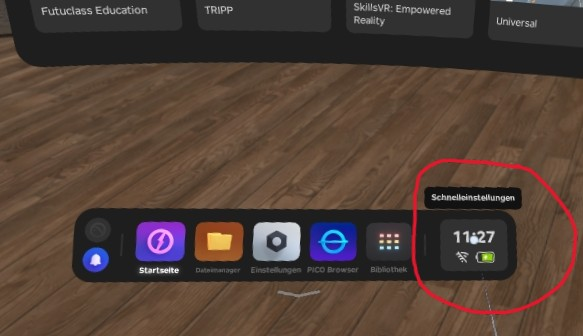
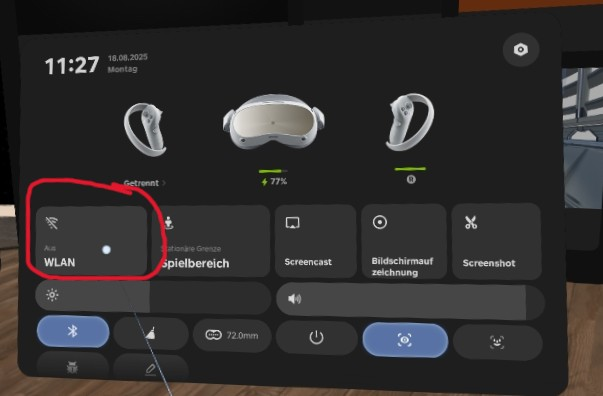
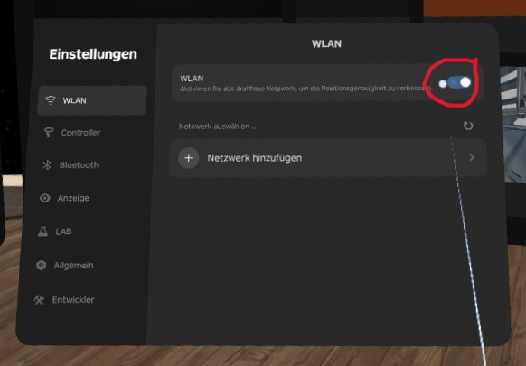
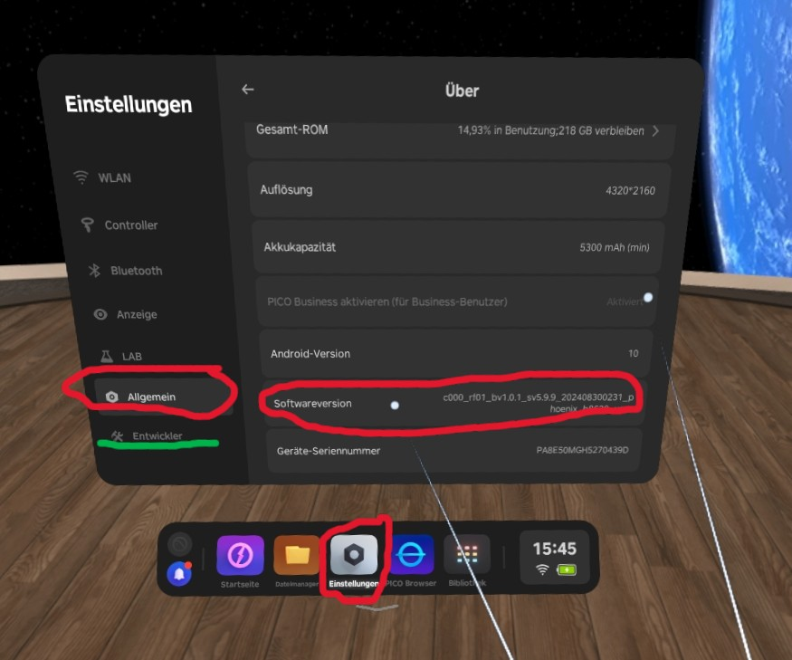
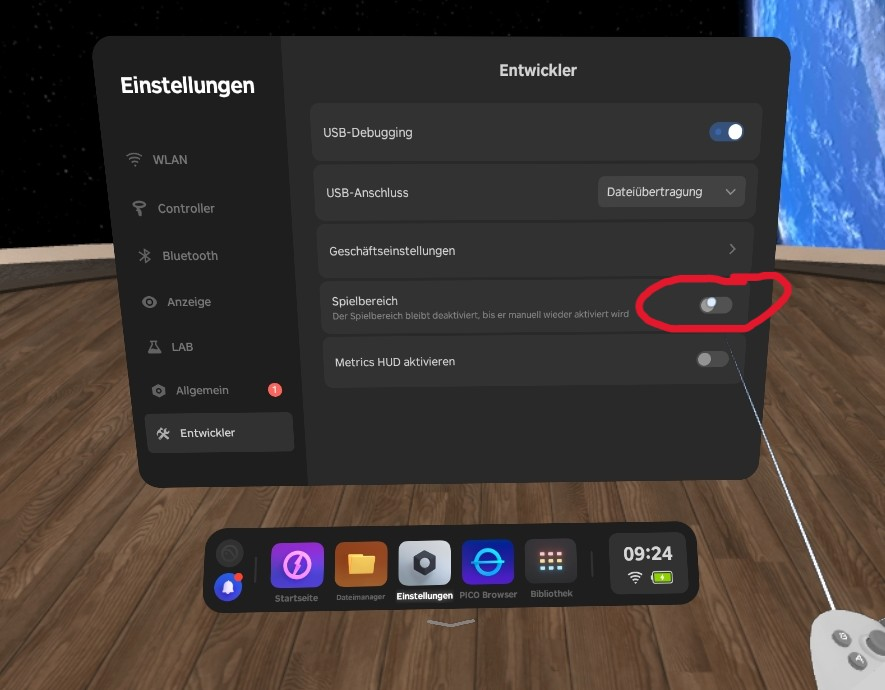
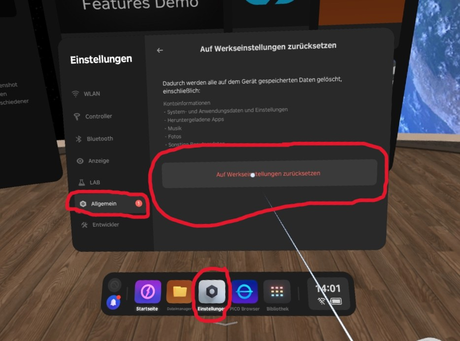

# Wichtige Einstellungen in der PICO 4

Dieser Bereich enthält alle wichtigen Einstellungen der PICO 4, um das bestmögliche Erlebnis sicherzustellen.

---

## Mit dem Internet verbinden

1. Klicke unten im Dock auf **Schnelleinstellungen**.

    { width="600" }

2. Klicke unten in den Schnelleinstellungen auf **WLAN**.

    { width="600" }

3. **Aktiviere** in den WLAN-Einstellungen das WLAN der PICO 4 und verbinde dich mit dem entsprechenden Zugangspunkt.

    { width="600" }

---

## Entwicklereinstellungen aktivieren

1. Gehe in deiner PICO 4 in die **Einstellungen > Allgemein > Über**.
2. Klicke dort so oft auf **Softwareversion**, bis links der Reiter **Entwickler** erscheint.

    { width="600" }

---

## Spielbereich deaktivieren
Um dich frei und ohne Begrenzungen im Raum bewegen zu können ist es von Vorteil den Spielbereich in den Entwicklereinstellungen zu deaktivieren

1. Stelle sicher, dass du die **Entwicklereinstellungen** aktiviert hast. Eine Anleitung dazu findest du [hier](./konfiguration.md#entwicklereinstellungen-aktivieren). 

2. Navigiere zu **Einstellungen > Entwickler**. Deaktiviere hier die Schaltfläche **Spielbereich**.

    { width="600" }

*Achtung! Achte auf deine Umgebung bei virtuellen Hintergründen. Hier besteht Verletzungsgefahr!*

---

## Bildschirm zentrieren

Da die VR-Brillen beim Start unterschiedlich zentriert sein können, muss der Bildschirm kalibriert werden, damit die Haubitze für alle Spieler an der gleichen Position im Raum steht.

1.  Setze die Brille auf und aktiviere die **[Kameradurchsicht](./steuerung.md#hintergrund-wechseln)**.
2.  Suche dir einen **Fixpunkt** in deiner realen Umgebung und zentriere deinen Blick darauf.
3.  Halte die **PICO-Taste** deines Controllers für etwa 1 Sekunde gedrückt. **Wichtig!** Achte darauf, deinen Blick beim Drücken der Taste nicht von dem Fixpunkt zu nehmen.

    { width="400" }

4.  Die Haubitze sollte sich nun im Verhältnis zum realen Raum bewegt haben. Wiederhole die Schritte für alle Brillen, wobei du immer denselben **Fixpunkt** und dieselbe **Standposition** verwendest.

---

## Auf Werkseinstellungen zuruecksetzen
Wenn die Kameradurchsicht nicht funktioniert bzw. die App allgemein nicht richtig funktioniert, solltest du deine PICO 4 auf **Werkseinstellungen** zurücksetzen.

1. Gehe auf **Einstellungen > Allgemein > Auf Werkseinstellung zurücksetzen**.
2. Drücke auf **Auf Werkseinstellung zurücksetzen**.

    { width="600" }

*Achtung! Nach dem Zurücksetzen musst du die App neu installieren. Hierzu findest du [hier](./installation.md) eine detaillierte Anleitung*
