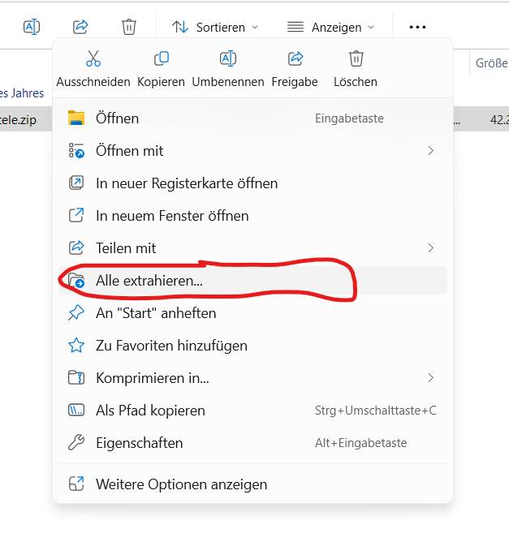
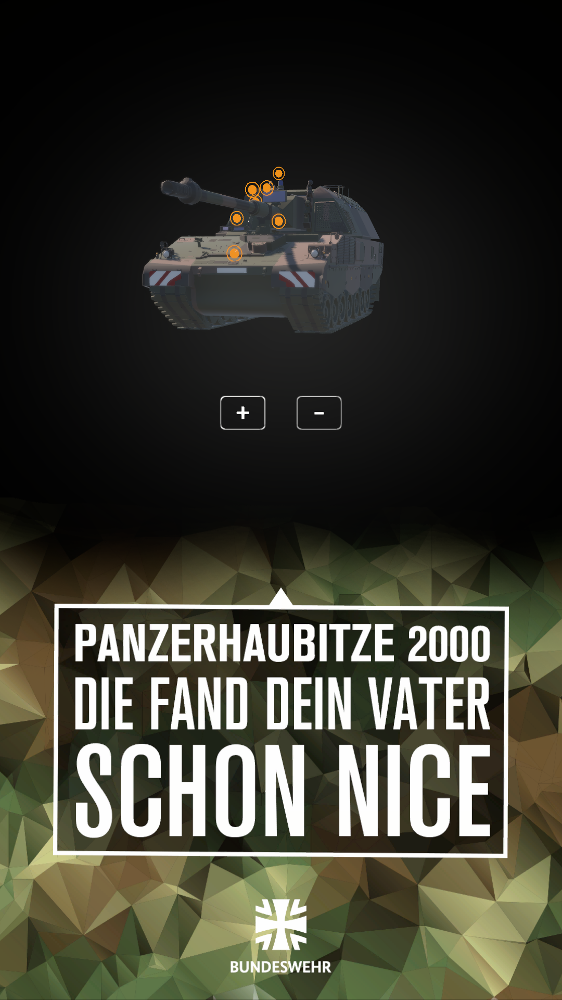

# Anleitung zur Anwendung der PzH2000 für die digitale Stele

Um die VR-App auf z.B. Messen zu bewerben, gibt es eine Anwendung für die digitalen Windows-Stelen.

**Hier sind die wichtigsten Funktionen der Anwendung:**

* **3D-Modell drehen:** Du kannst das Modell aus jedem Winkel betrachten. **Nutze dafür den Touchscreen** und bewege deine Hand, um die Ansicht zu drehen.

* **Zoomen:** Um Details genauer zu erkennen, kannst du die Ansicht vergrößern oder verkleinern. Nutze dafür die **Plus- (+) und Minus- (-)** Tasten auf der Benutzeroberfläche.

* **Infopunkte entdecken:** Überall am Modell sind interaktive Punkte verteilt. **Berühre einen Infopunkt**, um ein Fenster mit detaillierten Informationen zu diesem Bauteil zu öffnen.

---

## Was benötigst du?

* **PzH2000 Stele-Anwendung:** Diese kannst du [hier](https://github.com/bazi24/PzH2000-Stele/releases/download/v1.0/PzH-Stele.zip) herunterladen.
* **Entweder:** Einen PC und einen USB-Datenträger
* **Oder:** Eine Internetverbindung auf der Stele

---

## Wie kann ich die Anwendung starten?

1. Lade die Datei entweder direkt auf die Stele herunter oder auf einen PC herunter.
2. Verschiebe die ZIP-Datei ggfs. auf die Stele
3. **Entpacke** die ZIP-Datei auf der Stele. Berühre dazu für ca. 3 Sekunden die ZIP-Datei und wähle anschließend **"Alle extrahieren..."** aus.

    { width="600" }
    
4. Wechsle in den entpackten Ordner. Durch Doppelklick auf **PzHbz-Stele.exe** wird die Anwendung gestartet

---

## Interaktive Steuerung

Erkunde das Modell mit einfachen Touch-Gesten.

* ***3D-Modell drehen:*** **Wische** mit dem Finger über das Modell, um es in jede beliebige Richtung zu drehen und aus allen Perspektiven zu betrachten. **Tippe** auf **(+)** oder **(-)**, um den Zoom zu verändern.

* ***Infopunkte entdecken:*** Um mehr über einzelne Bauteile zu erfahren, **tippe** einfach auf einen der **orangefarbenen Infopunkte**. Ein Fenster mit detaillierten Informationen wird sich öffnen.

{ width="400" }