# Grundlagen der Bedienung der Anwendung PzH2000

Hier wird die grundlegende Bedienung sowie die Steuerung in der VR-Anwendung erklärt.

---

## Starten der App

1. Klicke im Dock deiner PICO 4 auf **Bibliothek**, dort sollte die Anwendung **PzH2000** installiert sein (falls nicht, folge dieser [Installationsanleitung](./installation.md)).
2. Klicke auf das App Icon *PzH2000* und die Anwendung öffnet sich.

    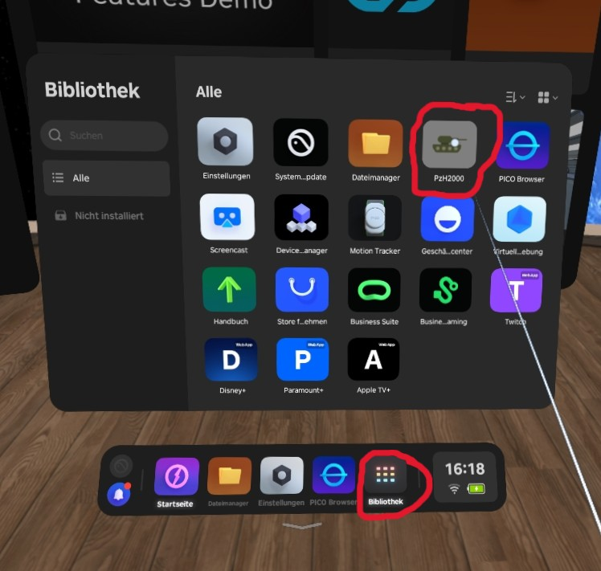{ width="600" }

**Nach dem Öffnen der App bist du im Warteraum:**

* Falls deine Brille mit dem Internet verbunden ist, wird automatisch der [Mehrspieler](multiplayer.md)-Modus gestartet.

* Falls nicht, kannst du per **Trigger**-Klick auf **Offline Modus** den Einzelspieler-Modus starten.

    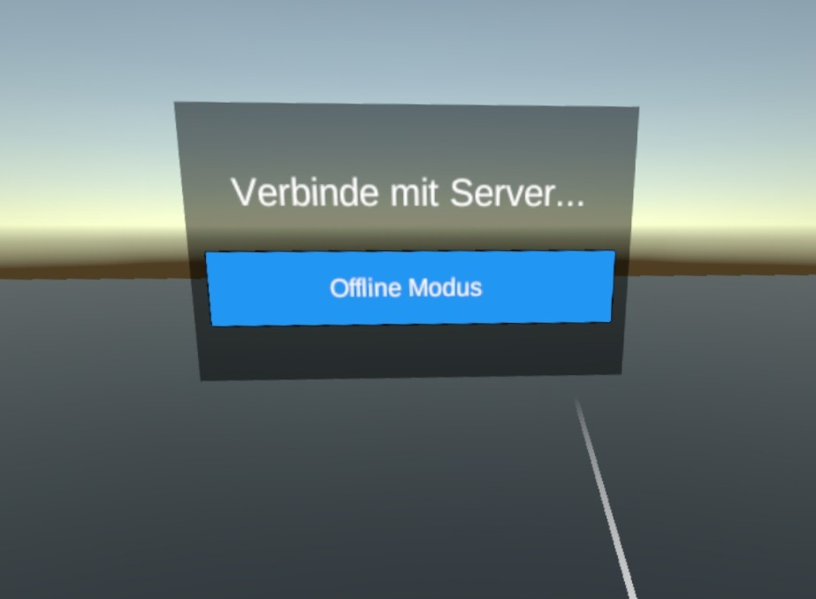{ width="600" }

**Damit die Haubitze für alle Spieler an derselben Stelle im Raum steht, folge einfach dieser [Anleitung](./konfiguration.md#bildschirm-zentrieren).**

---

## Beenden der App

1. Drücke auf deinem rechten oder linken Controller die **PICO**-Taste für **kurze** Zeit.

    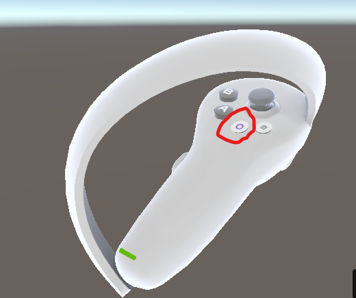{ width="400" }

2. Drücke auf **Verlassen und Zurück zum Start**.

    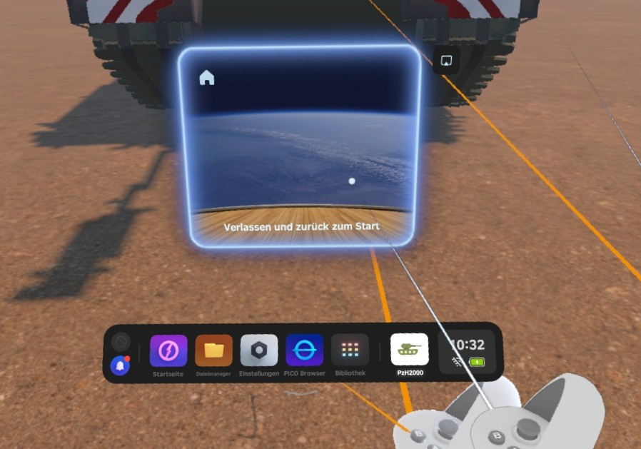{ width="600" }

---

## Bedienung

Dieser Bereich zeigt dir die Steuerung als Spieler in der App im Detail.

### Controller-Übersicht
Nach dem Start der App kannst du nach unten auf deine Controller blicken. Die eingeblendeten Beschriftungen sind dauerhaft sichtbar, um dir die Steuerung so einfach wie möglich zu machen.

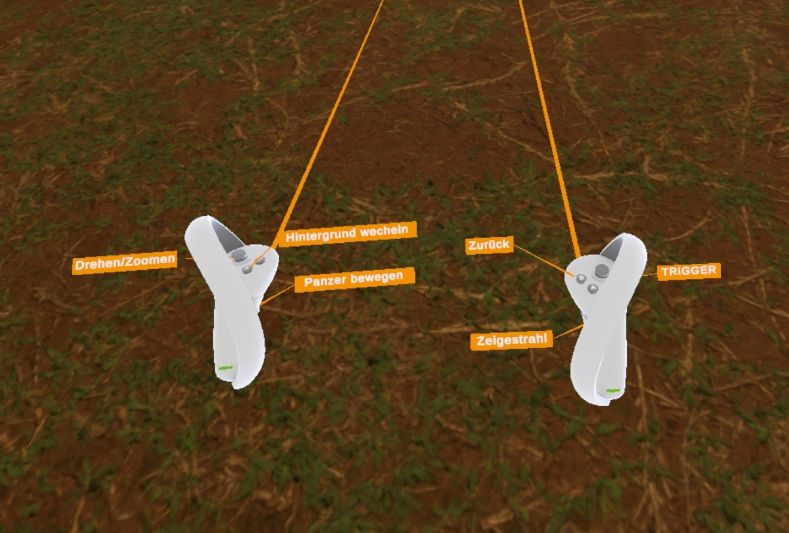{ width="600" }

---

### Bewegung im Raum
Um dich um die Haubitze zu bewegen, gehe einfach in der realen Welt um sie herum.

**Tipp:**

* Um dich ohne Einschränkungen um die Haubitze bewegen zu können, schalte den [Spielbereich](./konfiguration.md#spielbereich-deaktivieren) in den Einstellungen deiner PICO 4 aus.

*Achtung! Achte auf deine Umgebung bei eingeschalteten Hintergründen. Hier besteht Verletzungsgefahr!*

---

### Rechter Controller

Der rechte Controller wird zum Interagieren mit der Panzerhaubitze 2000 benutzt. Du kannst damit Infopunkte **aktivieren**, **schließen** und im [Mehrspieler](./multiplayer.md)-Modus den, für andere sichtbaren **Zeigestrahl** aktivieren.

***Hinweis:*** Der Controller mit den Tasten **A** und **B** ist für die **rechte Hand**.

---

#### Infopunkte aktivieren

Infopunkte werden durch den **Trigger** aktiviert. Dieser wird mit dem rechten **Zeigefinger** gedrückt und ist die primäre Taste für die Interaktion. Richte den Strahl des Controllers auf einen **Infopunkt** und drücke den Trigger, um ihn zu **aktivieren**.

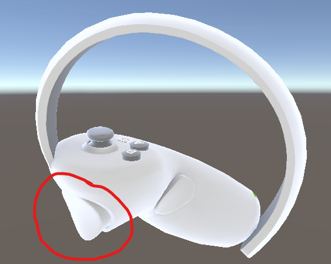{ width="400" }

---

#### Infopunkte schliessen

Um einen aktivierten Infopunkt zu **schließen** wirde der **B**-Knopf genutzt. Im Falle eines Video-Infopunkts, wird das Video gestoppt, beim erneuten aktiveren wird es von vorne abgespielt.

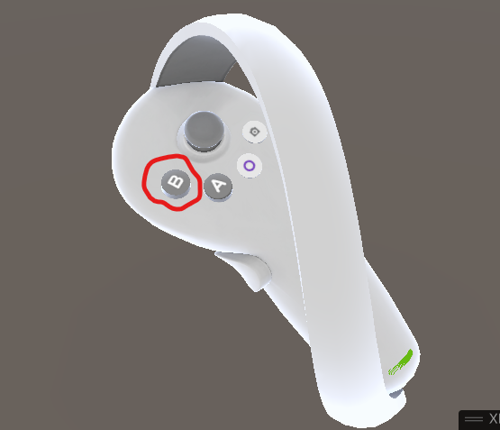{ width="400" }

---

#### Der Zeigestrahl

Der Zeigestrahl ist ein nützliches Werkzeug, um im Multiplayer-Modus auf Objekte zu zeigen. Um ihn zu aktivieren, drücke den **Grip**-Knopf mit deinem rechten Mittelfinger. Dein Zeigestrahl ist dann für alle anderen Spieler sichtbar.

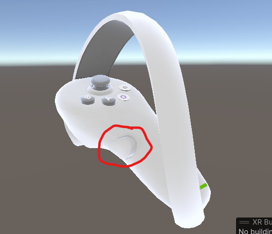{ width="400" }

---

### Linker Controller

Der linke Controller wird zum Einstellen der Szene genutzt. Mit ihm kannst du die Panzerhaubitze **bewegen** und die **Hintergründe wechseln**.

***Hinweis:*** Der Controller mit den Tasten **X** und **Y** ist für die **linke Hand**.

*Achtung! Achte auf deine Umgebung bei eingeschalteten Hintergründen. Hier besteht Verletzungsgefahr!*

---

#### Panzerhaubitze bewegen

Um die Panzerhaubitze entsprechend deiner Handbewegung zu bewegen wird der **Grip**-Knopf des linken Controllers genutzt. Hierbei wird die Panzerhaubitze an deinen Controllerstrahl geheftet und du kannst sie frei platzieren.

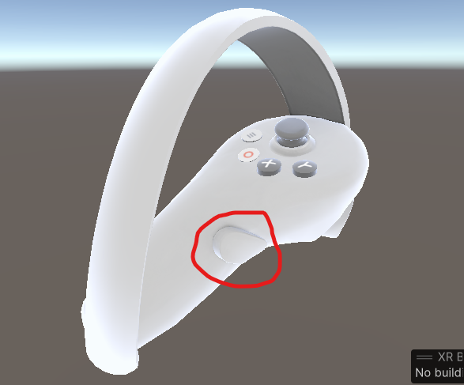{ width="400" }

Du kannst die Panzerhaubitze mit dem **Joystick** deines linken Controllers **zoomen** und **drehen**:

* Bewege den Joystick nach **links** oder **rechts**, um die Haubitze zu **drehen**.

* Bewege ihn nach **vorne** oder **hinten**, um die Ansicht zu **vergrößern** oder zu **verkleinern**.

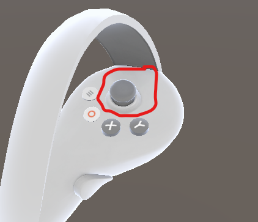{ width="400" }

---

#### Hintergrund wechseln

Drücke die **X**-Taste, um zwischen den vier verschiedenen **Hintergründen** zu **wechseln**. Der Standardhintergrund ist die **Kameradurchsicht**, mit der du die reale Umgebung sehen kannst.

Sollte die **Kameradurchsicht nicht richtig funktionieren**, dann muss deine PICO 4 auf **Werkseinstellungen zurückgesetzt werden**. Eine Anleitung dazu findest du [hier](./konfiguration.md#auf-werkseinstellungen-zuruecksetzen).

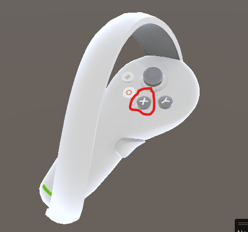{ width="400" }

**Wichtige Hinweise:**

*  *Achtung: Bei eingeschalteten Hintergründen siehst du deine reale Umgebung nicht mehr. Achte immer auf deine Umgebung, um dich nicht zu verletzen.*

*  *Achtung: Im Multiplayer-Modus wird der Hintergrund für alle Spieler synchronisiert. Denke daran, dass du deinen Mitspielern dadurch die Sicht nehmen kannst.* 

