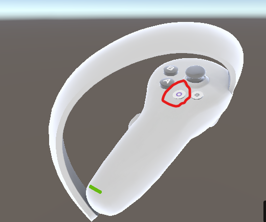

# Bedienung der PICO 4
Hier erfährst du wie man die VR-Brille grundsätzlich bedient.

---

## Einschalten
Um die PICO 4 einzuschalten, halte einfach den **länglichen Knopf** auf der **rechten Seite** der Brille gedrückt bis der Bildschirm angeht.

{ width="600" }

---

## Controller

### Controller einschalten

Um die Controller einzuschalten, nimm sie in die Hand und drücke den **PICO Knopf** so lange bis du ihn virtuell in der Brille sehen kannst.

{ width="400" }

* ***Beachte:*** Der Controller mit den Tasten **A** und **B** ist für die **rechte Hand**. Der Controller mit den Tasten **X** und **Y** ist für die **linke Hand**. 

---

### Menü bedienen

Um das Menü zu bedienen richte den Strahl des Controllers auf das entsprechende Icon im Menü und drücke den **Trigger**, dieser wird mit dem **Zeigefinger** bedient.

{ width="400" }

